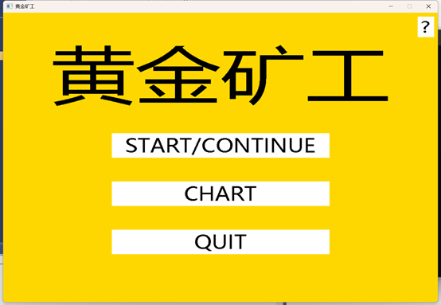
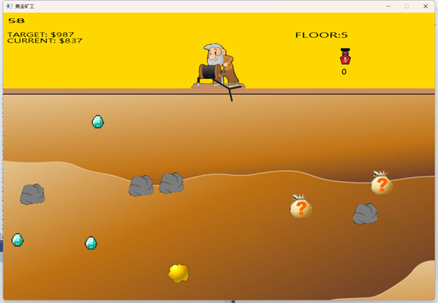
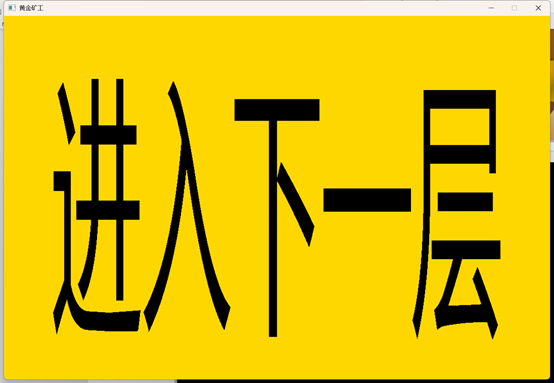
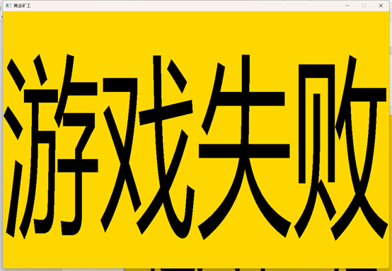
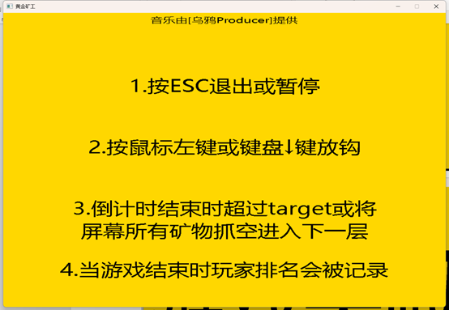
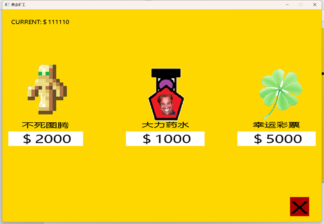
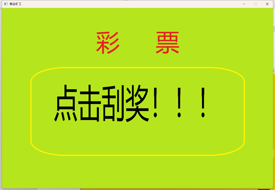
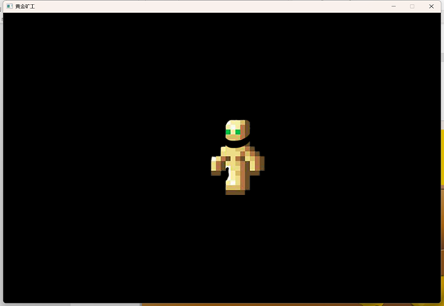
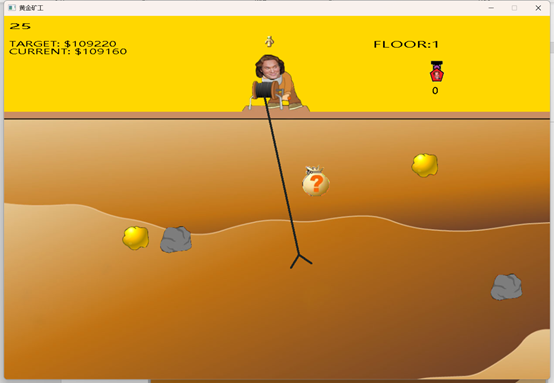

[中文](./README.md) | ENGLISH

# Replicating the Classic “Gold Miner” Game in C/C++

This project replicates the classic “Gold Miner” game using C/C++ and the EasyX graphics library. For any questions, feel free to contact the author.

* * *

Keywords:
---------

EasyX, mini game, C language, Gold Miner.

* * *

Project Information:
--------------------

The author was a freshman majoring in Software Engineering (Experimental Class) at Beijing University of Technology when developing this project. It is open-sourced in the hope that it may offer some, however modest, help to fellow learners.
This project was completed as the **"Advanced Programming Language Design (C Language)"** course project. It should suffice if you're looking for a big assignment project. However, I encourage you to add your own ideas and improvements to it.

The project uses open-source resources wherever possible. If any content violates rights, please contact the author for removal. Contact info is at the end of this document.

You are also welcome to email the author for more contact options (lol).

* * *

Game Analysis:
--------------

Gold Miner is a casual game. Players control the hook of a miner via keyboard or mouse within a limited time to collect minerals and gain points. When the 60-second countdown ends, if the player's score exceeds the target, they move to the next level; otherwise, the game ends, and the score is recorded on the leaderboard. Every 5 levels, players can visit a shop to purchase powerful items to assist with progress.

* * *

Game Features:
--------------

1. Upon entering the game, the miner’s hook swings left and right.

2. Various types of minerals are randomly distributed in the ground without overlapping. Types include three sizes of gold, rocks, mystery bags, and diamonds. Diamonds only appear on levels divisible by 5.

3. Press ↓ or left-click the mouse to launch the hook. If it touches a mineral's collision range, it grabs the item. Heavier minerals are slower to pull back. The hook returns if it hits the boundary.

4. Pulling back minerals earns points: large gold 50, medium gold 34, small gold 17, rocks 10, mystery bags 30–80 (random), diamonds 100.

5. The game shows the target score, current score, and countdown. Each level lasts 60 seconds. Target score is based on current score and total value of minerals on the field. If the player exceeds the target or clears all minerals, they advance to the next level. Otherwise, game over.

* * *

Additional Features:
--------------------

1. Visual interface: press `?` for help, `START/CONTINUE` to begin/continue the game, `chart` to view leaderboard, `quit` to save score and exit.

2. Press `ESCAPE` during the game to pause and return to the main menu.

3. Background music and sound effects are included.

4. After every 5 levels, players can enter a shop to buy items using points:
   
   * **Totem of Immortality (2000 points):** displayed in-game, automatically consumed once to avoid failure.
   
   * **Power Potion (1000 points):** click to use; boosts hook speed.
   
   * **Lucky Lottery (5000 points):** scratch to win 100,000 / 10,000 / 6,000 / 5,000 / 1,000 points. Average return is ~4700 points, with anti-gambling education intent.

5. Scores are recorded in the leaderboard after failure or quitting.

6. Countdown turns red when 5 seconds remain to alert the player.

* * *

Interface Preview:
------------------

### Menu

### Game Screen (Level 5 Example)

### Level Completed Screen

### Game Over Screen

### Help Screen

### Leaderboard

### Shop

### Lottery Screen

### Immortality Totem Effect

### Power Potion Effect

* * *

Demo Video
----------

[Project Demo](./项目展示.mp4) 

* * *

Contact & Final Notes:
----------------------

### Email

lrh1011101100@gmail.com

### Final Words

As the saying goes: "The waves of the Yangtze River drive on those ahead." Even a month after completing this project, I find many aspects of the code poorly written. I do not recommend learning from its style. I would be very grateful if someone is willing to help improve the code’s readability.

Let us all strive together and cultivate diligently in the world of code.
