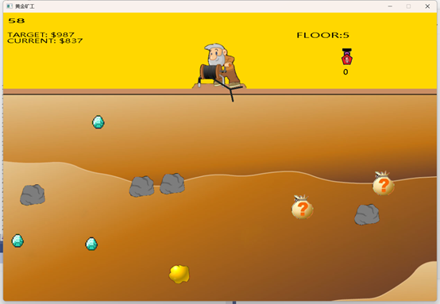
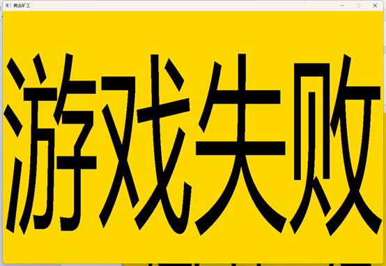
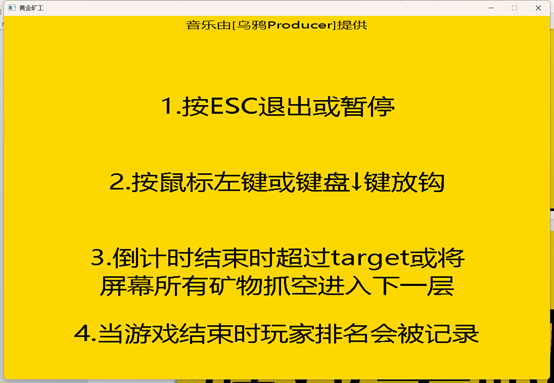
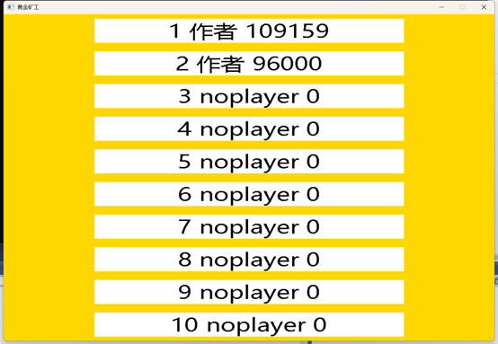
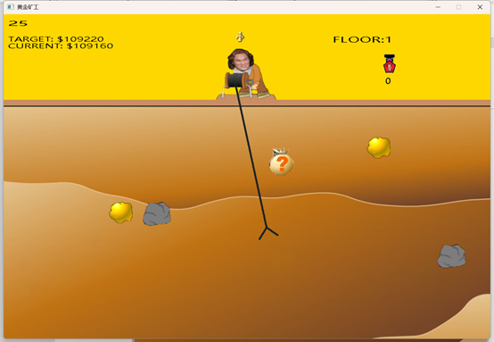

中文 | [ENGLISH](./README.EN.md) 

# 用c/c++语言复刻黄金矿工 Replicate the gold miner in c/c++ language

本项目主要使用了c/c++语言，以及Easyx库，对黄金矿工进行了复刻。如有任何问题，可以联系作者。

****

## 关键词：

EasyX, 小游戏, C语言, 黄金矿工.

****

## 项目信息：

作者在完成此项目时，是北京工业大学软件工程(实验班)大一新生，开源本项目是为了给各位后浪提供一些可能并不有力的帮助。

本项目为作者的 **高级程序语言设计(C语言)** 课设作品，假如想用本项目应付大作业的话，应该足矣。但我希望你们可以自己为这个项目填上一些自己的想法，修改一些本项目的不足。

本项目尽可能地使用了开源的资源。如若有侵权，可联系作者进行删除。作者邮箱在文末。

也欢迎各位发邮件询问作者的其他联系方式进行扩列（笑）。

****

## 项目分析

黄金矿工是一款休闲游戏。游戏要求玩家在有限时间内，通过键盘或鼠标控制矿工钩子的收放实现矿物的抓取。抓取后会获得相应的分数。当60秒倒计时结束后，如若玩家当前分数超过目标分数，则可进入下一层，否则判定为失败，并将玩家的分数录入排行榜。每过5层，玩家可进入商店购买强力道具助力玩家通关。

****

## 游戏功能

1. 进入游戏后矿工钩子左右摇摆。

2. 各类矿石随机分布在土地中且互不重叠。矿石包含3种不同大小金矿，石块，幸运盲袋，钻石。钻石只在能被5整除的层数中出现。

3. 按下↓键或鼠标左键发射钩子，如果钩子触碰到矿物判定范围，则拉取矿物。矿物重量不同，拉回速度不同。如若碰到边界，则原路返回。

4. 拉回矿物获得相应分数。大金矿物50分，中金矿34分，小金矿17分，石块10分，幸运盲袋在30分至80分随机，钻石100分。

5. 有目标分数、当前分数和倒计时显示。每关60秒，目标分数依据当前分数与场上矿物价值决定。在倒计时结束时到达或超越目标分数则可进入下一关，将场上所有矿物抓空可在倒计时结束前进入下一关。如若没有达到或超过目标分数则会在倒计时结束后游戏结束。
   
   ****

## 拓展功能

1. 可视化交互界面。按？可进入帮助界面，按START/CONTINUE按钮可开始或继续游戏，按chart按钮可查看排行榜，按quit按钮可将玩家分数写入排行榜并退出游戏。

2. 游戏中按ESCAPE键可暂停游戏并回到主界面。

3. 加入了背景音乐与相应的音效。

4. 在可被5整除的关卡后增加了商店，玩家可以消耗分数购买道具。道具包括2000分的不死图腾，购买后在游戏界面有相应的显示，会自动消耗并免疫一次游戏失败，1000分的大力药水，在游戏界面点击使用后，矿工会变身为大力王，使钩子伸长与收缩的速度加快，5000分的幸运彩票，购买后会进行刮奖，随机获得100000分，10000分，6000分，5000分，1000分，总体期望约为4700分，具有反赌教育意义。

5. 排行榜功能，在玩家游戏失败或按QUIT按钮退出后将玩家信息写入排行榜。

6. 倒计时剩余5秒时变红，提醒玩家时间所剩无几。
   
   ****

## 界面展示：

### 菜单

### 游戏界面(以第五关为例)

### 进入下一层界面

### 失败界面

### 帮助界面

### 排行榜界面

### 商店界面

### 刮彩票界面

### 不死图腾效果界面

### 大力王效果界面

****

## 展示视频

[项目展示](./项目展示.mp4) 

****

## 作者联系方式及后话：

### Email

lrh1011101100@gmail.com

****

### 后话

长江后浪推前浪，世上新人赶旧人。不用说学弟学妹，即使写完这个项目后一个月的我，看这个项目都觉得各个方面写的都十分狗屎。代码的风格不建议任何人学习。希望有人愿意免费为我修改代码，以使代码可读性更佳。

希望你我共勉，在代码的世界中执杖耘耔。
